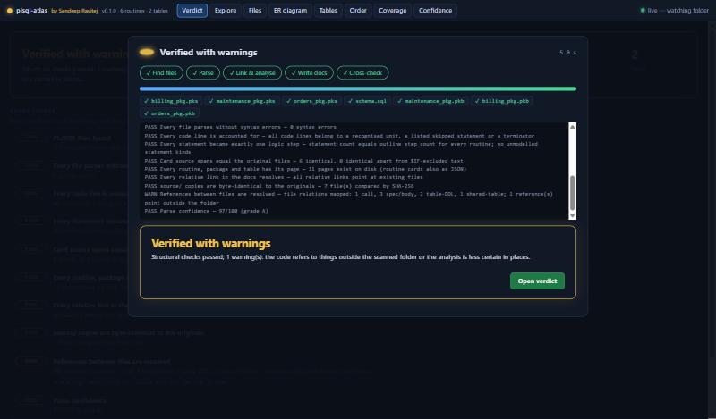
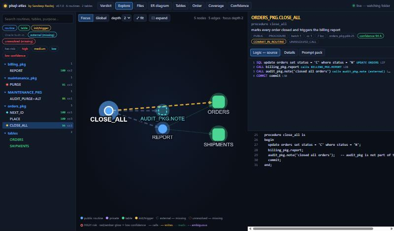
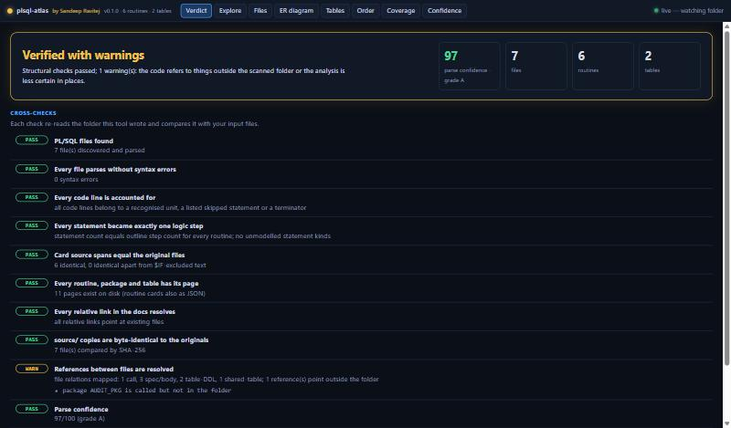
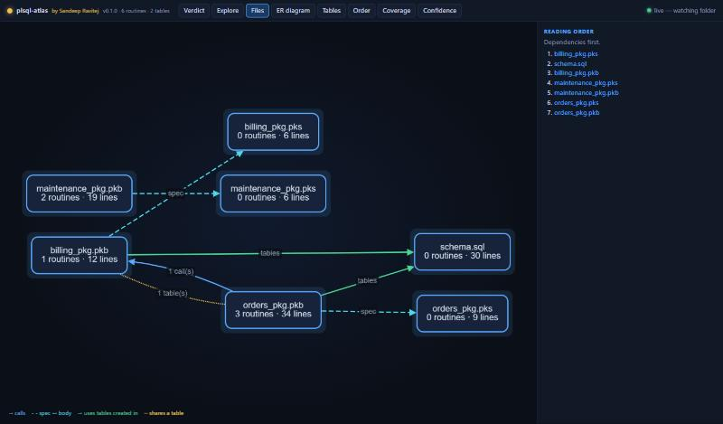
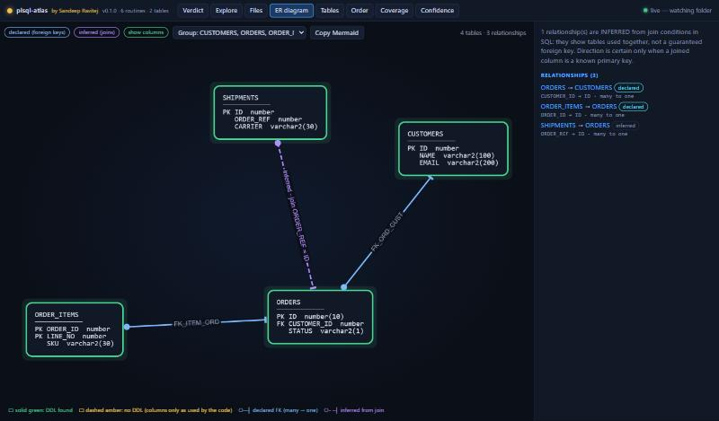
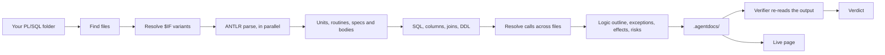

# plsql-atlas

*Created by **Sandeep Ravitej** · MIT License*

**Drop one jar into a folder of Oracle PL/SQL files, run it, and get documentation any coding agent can work from** — plus a live page that shows what it did and whether it can vouch for its own output.

It parses your code with a real ANTLR PL/SQL grammar (no regex guessing), works out how the files depend on each other, writes a self-contained card for every routine, an ER diagram, and then **cross-checks its own work and tells you the verdict**. It never calls an LLM and never connects to a database; it only reads your files.



## Quickstart

1. **Download** `plsql-atlas.jar` from the latest [GitHub release](../../releases/latest). You need Java 21 or newer (`java -version`).
2. **Copy the jar into the folder that holds your PL/SQL files** (`.sql .pks .pkb .pkg .fnc .prc .trg .vw .typ .tps .tpb .plsql`; sub-folders are scanned). Say it holds ten files that call each other.
3. **Run it there:**
   ```bash
   java -jar plsql-atlas.jar
   ```
   A page opens at <http://127.0.0.1:9000> showing the build live. When it finishes you get the verdict, and a **`.agentdocs/`** folder appears right next to your files.
4. **Give `.agentdocs/AGENTS.md` to your AI coding agent**. It tells the agent what to read in which order.

To keep it running while you edit, use `java -jar plsql-atlas.jar --watch`: it rebuilds whenever a PL/SQL file is saved and the open page shows the new build live.

| Option | What it does |
|---|---|
| `java -jar x.jar <folder>` | scan another folder instead of the current one |
| `--no-ui` | build and verify only, no web page; exit code 1 if the verdict is *not verified* (handy in CI) |
| `--watch` | stay running and rebuild when a PL/SQL file changes |
| `--port 9000` | first port to try (the next 99 are tried if busy); the server only listens on `127.0.0.1` |
| `--no-open` | do not open the browser |
| `-D name=value` | value of a conditional-compilation flag, e.g. `-D audit_enabled=true` |
| `-o <dir>` | write the docs somewhere else; `--no-source` skips the copy of your files in `source/` |

## What it does with your files

1. **Maps the relations between files.** A body that calls a routine defined in another file, a spec and its body, code that uses a table created in `schema.sql`, two files that write the same table — all become edges in `analysis/file-dependencies.md`, with a *read these first* order.
2. **Understands each routine's logic.** Every `IF`/`CASE`/loop/`GOTO`/`RAISE`/handler/`COMMIT` becomes a numbered step; every SQL statement is kept verbatim with the tables and columns it reads and writes; calls are resolved across files; Oracle-specific hazards (swallowed `WHEN OTHERS`, dynamic SQL built by concatenation, row-by-row DML, autonomous transactions, …) are flagged.
3. **Draws the ER diagram.** Columns, types and keys come from any `CREATE TABLE` / `ALTER TABLE ... ADD CONSTRAINT` in your folder; relationships are *declared* (foreign keys) or *inferred* from join conditions in your SQL, and the two are labelled differently.
4. **Verifies itself** and reports a verdict (below).



### The verdict

After writing, the tool re-reads the folder it wrote and compares it with your input:

| Check | Fails when |
|---|---|
| Every file parses | any syntax error (the parser recovered, so logic near it may be incomplete) |
| Every code line is accounted for | a line belongs to no recognised unit and no listed skipped statement |
| Every statement became one logic step | a statement was dropped, double-counted or of an unmodelled kind |
| Card source equals the original file | a card's embedded source differs from your file |
| Every routine, package and table has its page | a page is missing on disk |
| Every relative link resolves | a link in the docs points nowhere |
| `source/` is byte-identical (SHA-256) | a copy differs from the original |
| References between files are resolved | *warning:* something is called that is not in the folder (e.g. a package you did not include) |
| Parse confidence | below 60 fails, below 90 warns |

The result is **Verified**, **Verified with warnings** or **Not verified**, shown on the Verdict page, printed in the console and saved as `analysis/verification.md`. A warning is honest information, not a defect of the tool: it lists the objects your code relies on that were not in the folder.



## What you get

```
your-folder/
├── billing_pkg.pkb  orders_pkg.pkb  schema.sql  …      your files, untouched
└── .agentdocs/
    ├── AGENTS.md                  start here: reading order, rules for the agent, legend
    ├── OVERVIEW.md                packages, tables, entry points, most complex routines
    ├── INDEX.json                 every routine: purpose, size, risks, calls, conversion batch
    ├── objects/<package>/         _package.md + one card per routine (.md and .json)
    ├── tables/<table>.md          who reads/writes it, columns, impact
    ├── analysis/
    │   ├── file-dependencies.md   how the files relate + reading order + diagram
    │   ├── er-diagram.md          Mermaid ER diagram, tables, relationships and where each came from
    │   ├── verification.md        the verdict and every check
    │   ├── confidence.md          per-routine certainty and the list of missing artifacts
    │   ├── migration-order.md     callees-before-callers batches
    │   ├── risks.md  coverage.md
    └── source/                    byte-identical copies the cards cite by line number
```

A routine card contains the signature, a purpose line taken from names and comments, the numbered logic outline, every SQL statement, calls out and in, state and side effects, the exception contract, Oracle semantics notes and the original source. The screenshots on this page show a small made-up shop project (orders, billing, a schema file and a maintenance package) after the tool has processed it.





## The live page

The page is only a mirror of the folder: it holds no data of its own and carries nothing from one project to the next. While a build runs it shows the stages and each file as it is parsed; afterwards it shows the **Verdict**, an **Explore** view (searchable tree, animated call graph, logic outline linked to the source lines, a *prompt pack* that bundles a routine with its callees and tables and estimates the tokens), the **Files** map, the **ER diagram**, table impact, the understanding order, line coverage, and the **Confidence** view with everything the code needs but the folder lacks. Rebuild in the same folder and it refreshes itself.

## How it works



Conditional compilation (`$IF … $THEN … $END`) is analysed twice — with undefined flags as Oracle treats them, and with them on — so no branch is silently lost; routines that exist only in the second variant are listed.

## Results on real code

On [Logger](https://github.com/OraOpenSource/Logger) and [Alexandria PL/SQL utils](https://github.com/mortenbra/alexandria-plsql-utils) (7 files, ~5,400 lines): 0 syntax errors, 128 routine cards, every code line accounted for, parse confidence 96/100 (A), and a *verified with warnings* verdict because the code refers to a collection type defined outside those files. About 9 seconds including JVM start.

## Honest limitations

- It is **static analysis of your files only**. Anything the code needs from outside them (other packages, schema-level types, synonyms, grants, views you did not include) is listed as a missing artifact, not guessed.
- Overloads are resolved by argument count and names, not argument types; ambiguous ones stay as candidates.
- Column attribution for unqualified columns works only when a statement has exactly one table.
- **ER relationships**: declared ones come from DDL in the folder. Without DDL the diagram shows only columns the code uses (unknown types and keys), and relationships are *inferred* from `a.x = b.y` joins, so they show tables used together, not guaranteed constraints. Names like `customer_id` are not used to guess foreign keys.
- Package-state tracking ignores writes through `OUT` arguments. Object type bodies, views and non-table DDL are listed as skipped, not decomposed.
- A syntax error makes the verdict *not verified* on purpose: the docs may be missing logic near it.

## Build from source

```bash
./mvnw -B verify                      # JDK 21 is the only requirement
bash scripts/fetch-real-world-corpus.sh   # (or .ps1) optional: real-world test corpus, not vendored
java -jar target/plsql-atlas.jar path/to/your/plsql/folder
```

Developer commands (`check`, `outline`, `graph`, `risks`, `build`, `explore`) are available; run the jar with `--help`.

## Releases

Pushing a version tag (`git tag v0.1.0 && git push origin v0.1.0`) runs [`release.yml`](.github/workflows/release.yml): it builds and tests, smoke-tests the jar exactly as described in the quickstart, and publishes the jar with a SHA-256 checksum as a GitHub release.

## Roadmap

M1–M7 are complete; see [docs/PLAN.md](docs/PLAN.md) for the design notes and the milestone history.

## License

MIT, Copyright (c) 2026 Sandeep Ravitej — see [LICENSE](LICENSE). Anyone who copies or modifies the code must keep that copyright and license notice.

Third-party components keep their own licenses: the PL/SQL grammar from [antlr/grammars-v4](https://github.com/antlr/grammars-v4/tree/master/sql/plsql) is **Apache 2.0** (we modified it; the changes are listed), ANTLR is BSD-3, Jackson and picocli are Apache 2.0, and the Explorer bundles Cytoscape.js and its layout plug-ins (MIT). See [NOTICE](NOTICE) and [THIRD_PARTY_LICENSES.txt](THIRD_PARTY_LICENSES.txt); both are also inside the jar.
